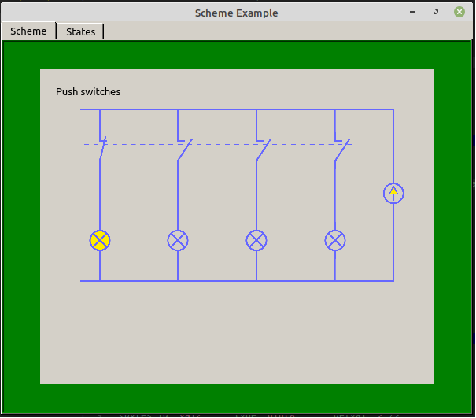
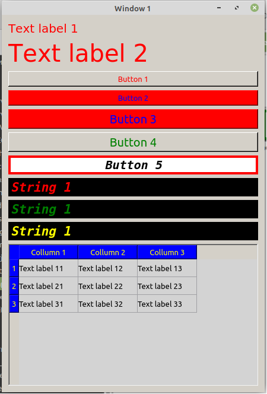

#
\[En\]
#
# Introduction.
   TeleNEXus is a program for building SCADA (Supervisory Control And
 Data Acquisition) and ICS (Industrial Control System) systems.
   The ideological basis of TeleNEXus is a description of the graphical interface and other
 elements through Extensible Markup Language XML. The main meaning of this
 is that when using the graphical interface for
 building SCADA systems after a certain level of complexity becomes
 time-consuming not only to make changes, but also to track them.
   An analogy can be drawn with digital systems, which
 great to develop with graphical tools only up to
 a certain limit, and then comes the turn of hardware description languages
 integrated circuits such as VHDL or Verilog.
   The software basis of TeleNEXus is the Qt framework, due to which
 provides cross-platform.

# Features.
 - Cross-platform;
 - For the development of the project you need only a text editor;
 - Security system to restrict access to the functions described
   systems;
 - Ability to work in embedded systems with touchscreen;
 - Built-in ability to create on-screen keyboards;
 - Ability to use JavaScript to describe behavior
   systems, data processing, and response to operator actions;
 - Ability to connect plugins in the form of dynamic libraries for
   expanding the possibilities of building a graphical interface and implementing
   data transfer protocols.

# Compiling.
  The project consists of three separately compiled parts:
- The main part of TeleNEXus located in the folder `tnexcore`;
- The launcher located in the `tools/launcher` folder;
- MODBUS data source implementation plugin in the `plugins/modvussource` folder.

## Linux.
  To fully compile the entire project, you can use the bash script file
`build.sh` with the `-jN` option indicating the number of compilation threads, or you can
compile all parts separately using qmake and make.
After compilation, you can use the install.sh script which will copy
executable files and plugins to the `/opt/tnex` and `/opt/tnex/plugins` folders, as well as
create a tnex link in `/usr/bin/`

## Windows.
  If you have the Linux Subsystem for Windows installed on your system, you can
use the bash script file `win_build.sh` with the `-jN` option to specify
number of compilation threads.
  The `win_build.sh` file contains substitutions for the qmake and make commands at the beginning
which need to be changed in accordance with the utilities you have installed.
  You can use QtCreator to compile all parts individually. For this
need to open files with `.pro` extension in QtCreator and after settings
projects to compile.
  After compiling the project, you need to deploy it using
Qt utility `windeployqt.ext`, or if compilation was done by a script
`win_build.sh`, you can use the `win_deploy.sh` script as a result of work
which the `win_deploy` folder should appear containing all executable files
and libraries necessary for the program to work.

# Usage.
## Console.
   There are two ways to run a project in the console:
   - Go to the project folder and run the tnex command, this will produce
   search for the root file of the project with the name `main.xml`;
   - Run a command like `tnex "xml file name or path to project"`
## tnexluncher project manager.
   Using this small program, you can quickly launch different projects.
   The program has a simple graphical interface and supports all possible
   project launch options

# Examples.
  Examples of simple projects designed to familiarize with the functions 
  of the program are given in the folder './examples'

## Showcase
  Screenshot of the sample project with the scheme "Set of light bulbs and buttons"
  `examples/example_projects/mnemoscheme`.

  Screenshot of widget style examples
  `examples/widgetstyles`.

#
\[RU\]
#
# Введение.
  TeleNEXus это программа для построения SCADA (Supervisory Control And 
Data Acquisitionи) и ICS (Industrial Control System) систем. 
  Идейная основа TeleNEXus это описание графического интерфейса и других 
элементов посредством расширяемого языка разметки XML. Основной смысл этого
заключается в том, что при использовании графического интерфейса для 
построения SCADA систем после определенного уровня сложности становится 
трудоемко не только вносить изменения, но и производить их отслеживание. 
  Можно провести аналогию с цифровыми системами, которые 
прекрасно разрабатывать при помощи графических инструментов только до
определенного предела, а затем наступает очередь языков описания аппаратуры 
интегральных схем таких как VHDL или Verilog.
  Програмной основой TeleNEXus является фреймворк Qt за счет чего 
обеспечивается кроссплатформенность.

# Особенности.
- Кроссплатформенность;
- Для рызработки проекта нужен только текствый редактор;
- Система безопасности для ограничения доступа к функциям описываемой
  системы;
- Возможность работы во встроенных системах с экранами TouchScreen;
- Встроенная возможность создания экранных клавиатур;
- Возможность использования скриптов JavaScript для описания поведения
  системы, обработки данных, и реакции на действия оператора;
- Возможность подключения плагинов в виде динамических библиотек для
  расширения возможностей построения графического интерфейса и реализации
  протоколов передачи данных.

# Компилирование.
  Проект состоит из трех отдельно компилируемых частей:
- Основная часть TeleNEXus расположенная в папке `tnexcore`;
- Программа запуска расположенная в папке `tools/launcher`;
- Плагин реализации источника данных MODBUS в папке `plugins/modvussource`.

## Linux.
  Для полной компиляции всего проекта можно исользовать файл bash скрипта
`build.sh` с параметром `-jN` указывающий количество потоков компиляции, или можно
компилировать все части по отдельности, используя утилиту qmake и make.
После компиляции можно использовать скрипт install.sh который скопирует
исполняемые файлы и плагины в папку `/opt/tnex` и `/opt/tnex/plugins`, а также
создаые ссылку tnex в папке `/usr/bin/`

## Windows.
  Если в вашей системе установлена подсистема Linux для Windows можно 
исользовать файл bash скрипта `win_build.sh` с параметром `-jN` указывающий 
количество потоков компиляции.
  В файле `win_build.sh` в начале указаны подстановки для команды qmake и make
которые необходимо изменить в соотвенствии с установленными у вас утилитами.
  Вы можете QtCreator, чтобы компилировать все части по отдельности. Для этого 
необходимо открыть файлы с расширением `.pro` в QtCreator и после настроек 
проектов произвести компиляцию.
  После компиляции проекта необходимо произвести его развертывание используя 
утилиту Qt `windeployqt.ext`, или если компиляция производилась скриптом  
`win_build.sh`, можно использовать скрипт `win_deploy.sh` в результате работы 
которого должна появиться папка `win_deploy` содержащая все исполняемые файлы
и библиотеки небоходимые для работы программы.

# Использование.
## Консоль.
  Для запуска проекта в консоли можно использовать два пути:
  - Перейти в папку проекта и запустить команду tnex, при этом будет произведен
  поиск корневого файла проекта с именем `main.xml`;
  - Выполнить команду вида `tnex "xml file name or path to project"`
## Менеджер проектов tnexluncher.
  Используя эту небольшую программу можно быстро запускать разные проекты.
  Программа имеет простой графический интерфейс и поддерживает все возможные
  варианты запуска проекта.

# Examples.
  Examples of simple projects designed to familiarize with the functions 
  of the program are given in the folder './examples'
